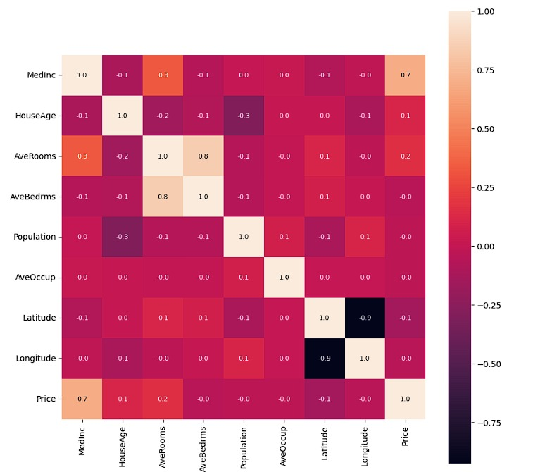

# California Housing Price Prediction

Predicting California housing prices using **XGBoost**. This project demonstrates the full ML workflow: data exploration, visualization, model training, and evaluation.

## Features
- Data exploration & correlation analysis using **Pandas** & **Seaborn**
- Regression model built with **XGBoost Regressor**
- Model evaluation:
  - **MAE:** 0.31
  - **R² Score:** 0.83
- Visualization: Scatter plot of Actual vs Predicted prices and correlation heatmap
- Comparison table of **Actual vs Predicted Prices** with **Error** column

## Example: Actual vs Predicted Prices

| Actual_Price | Predicted_Price | Error  |
|--------------|----------------|--------|
| 0.477        | 0.594          | 0.117  |
| 0.458        | 0.784          | 0.326  |
| 5.000        | 5.198          | 0.198  |
| 2.186        | 2.440          | 0.254  |
| 2.780        | 2.427          | -0.353 |

> Error = Predicted_Price - Actual_Price

## Visualizations




## Libraries
`numpy`, `pandas`, `matplotlib`, `seaborn`, `scikit-learn`, `xgboost`

## How to Run
1. Clone this repository.
2. Install dependencies:  
   ```bash
   pip install numpy pandas matplotlib seaborn scikit-learn xgboost
